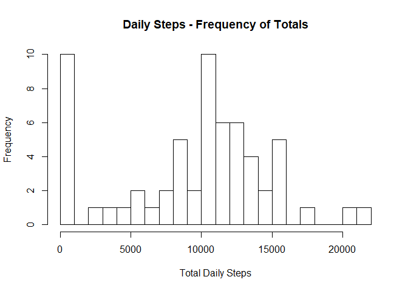
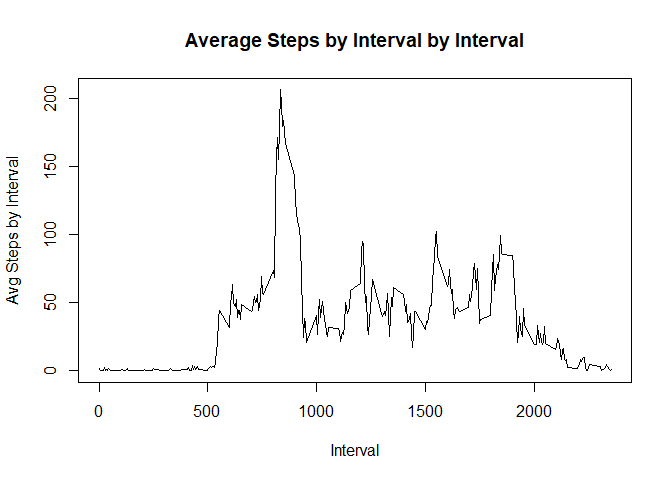
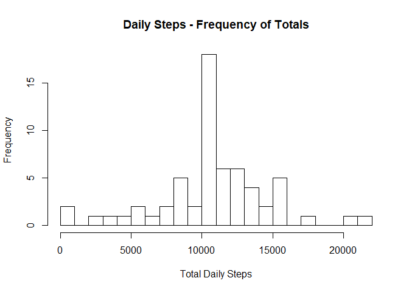
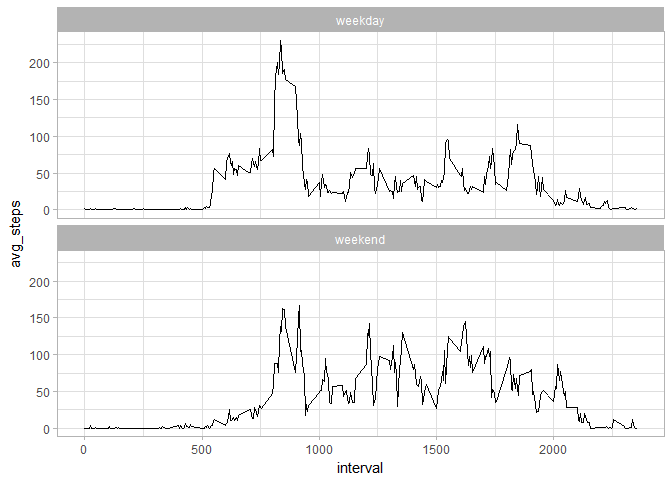

## Get necessary packages


```r
# load packages
library(readr)
library(dplyr)
library(ggplot2)
```

## Loading and preprocessing the data

First step to read in dataset and check a few rows.


```r
# read data
fitbit <- read_csv("activity.csv", col_names=TRUE)

# check data table for correct classes and clean read
head(fitbit)
```

```
## # A tibble: 6 x 3
##   steps       date interval
##   <int>     <date>    <int>
## 1    NA 2012-10-01        0
## 2    NA 2012-10-01        5
## 3    NA 2012-10-01       10
## 4    NA 2012-10-01       15
## 5    NA 2012-10-01       20
## 6    NA 2012-10-01       25
```

Data appears to be tidy and variable classes are good to go.

## What is mean total number of steps taken per day?

__1. Calculate the total number of steps taken per day__


```r
# group data by date and get total number of steps per day, then the mean
daily_total_steps <- fitbit%>%
  group_by(date)%>%
  summarize(total=sum(steps, na.rm=TRUE))

head(daily_total_steps)
```

```
## # A tibble: 6 x 2
##         date total
##       <date> <int>
## 1 2012-10-01     0
## 2 2012-10-02   126
## 3 2012-10-03 11352
## 4 2012-10-04 12116
## 5 2012-10-05 13294
## 6 2012-10-06 15420
```


__2. Make a histogram of the total number of steps taken each day__


```r
# plot histogram of daily totals
hist(daily_total_steps$total, 
     main="Daily Steps - Frequency of Totals",
     xlab="Total Daily Steps",
     breaks=20)
```

<!-- -->

__3. Calculate and report the mean and median of the total number of steps taken per day__


```r
# get mean number of steps
mean1 <- mean(daily_total_steps$total, na.rm = TRUE)
```

The mean of the daily total of steps is __9354.23 steps__.


```r
# get median number of steps
median(daily_total_steps$total, na.rm = TRUE)
```

```
## [1] 10395
```

## What is the average daily activity pattern?

__1. Make a time series plot (i.e. type = "l") of the 5-minute interval (x-axis) and the average number of steps taken, averaged across all days (y-axis).__


```r
# group data by date and get avg number of steps interval
avg_steps_per_interval <- fitbit%>%
  group_by(interval)%>%
  summarize(avg_steps=mean(steps, na.rm = TRUE))

head(avg_steps_per_interval)
```

```
## # A tibble: 6 x 2
##   interval avg_steps
##      <int>     <dbl>
## 1        0 1.7169811
## 2        5 0.3396226
## 3       10 0.1320755
## 4       15 0.1509434
## 5       20 0.0754717
## 6       25 2.0943396
```


```r
# line plot of avg_steps per interval by interval
plot(x=avg_steps_per_interval$interval, 
     y=avg_steps_per_interval$avg_steps,
     main="Average Steps by Interval by Interval",
     xlab="Interval", ylab="Avg Steps by Interval",
     type="l")
```

<!-- -->

__2. Which 5-minute interval, on average across all the days in the dataset, contains the maximum number of steps?__


```r
# get interval with max average steps 
idx <- which(avg_steps_per_interval$avg_steps==
               max(avg_steps_per_interval$avg_steps))

avg_steps_per_interval[104, "interval"][[1]]
```

```
## [1] 835
```

## Imputing missing values
__1. Calculate and report the total number of missing values in the dataset (i.e. the total number of rows with NAs).__


```r
# calculate number of rows with NA's
sum(is.na(fitbit$steps))
```

```
## [1] 2304
```

__2. Devise a strategy for filling in all of the missing values in the dataset. The strategy does not need to be sophisticated. For example, you could use the mean/median for that day, or the mean for that 5-minute interval, etc.__

__3. Create a new dataset that is equal to the original dataset but with the missing data filled in.__


```r
# impute missing data using mean number of steps for intervals
fitbit <- merge(fitbit, avg_steps_per_interval, by="interval")
idx <- which(is.na(fitbit$steps))
fitbit[idx, "steps"] <- fitbit[idx, "avg_steps"]
```

__4. Make a histogram of the total number of steps taken each day and Calculate and report the mean and median total number of steps taken per day.__


```r
# group data by date and get total number of steps per day, then the mean
daily_total_steps2 <- fitbit%>%
  group_by(date)%>%
  summarize(total=sum(steps, na.rm=TRUE))
```


```r
# plot histogram of daily totals
hist(daily_total_steps2$total, 
     main="Daily Steps - Frequency of Totals",
     xlab="Total Daily Steps",
     breaks=20)
```

<!-- -->

__Do these values differ from the estimates from the first part of the assignment? What is the impact of imputing missing data on the estimates of the total daily number of steps?__


```r
# get mean number of steps
mean(daily_total_steps2$total, na.rm = TRUE)
```

```
## [1] 10766.19
```


```r
# get median number of steps
median(daily_total_steps2$total, na.rm = TRUE)
```

```
## [1] 10766.19
```


## Are there differences in activity patterns between weekdays and weekends?

__1. Create a new factor variable in the dataset with two levels - "weekday" and "weekend" indicating whether a given date is a weekday or weekend day.__


```r
# create factor variable - levels = c("weekday", "weekend")
f_weekend <- function(d){ifelse(weekdays(d) %in% c("Saturday", "Sunday"),
                                "weekend", "weekday")}
fitbit$weekend <- sapply(fitbit$date, f_weekend)
```

__2. Make a panel plot containing a time series plot (i.e. type = "l") of the 5-minute interval (x-axis) and the average number of steps taken, averaged across all weekday days or weekend days (y-axis).__


```r
# group by interval and get means by interval
avg_steps_per_interval2 <- fitbit%>%
  group_by(interval, weekend)%>%
  summarize(avg_steps=mean(steps))

# plot line graphs
qplot(interval, avg_steps, data=avg_steps_per_interval2, geom="line") +
  facet_wrap(~weekend, nrow = 2, ncol = 1) + theme_light()
```

<!-- -->

